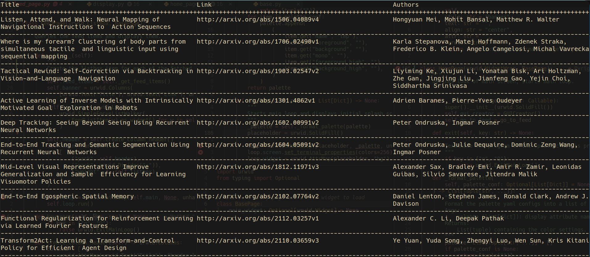

# Terminal-based feed parser
The purpose of this app is to condense various interesting feeds into a single terminal app.
Made mostly for my own convenience.
This app is built on the [urwid](https://urwid.org/index.html) library for Python, which is a wrapper over the ncurses
library for terminal applications in Linux.

Current status:

Currently I'm working on scraping the front page of [Papers with Code](https://paperswithcode.com/), and [arxiv](https://arxiv.org/) to return ML papers to the front end.

Author: Andres ponce
